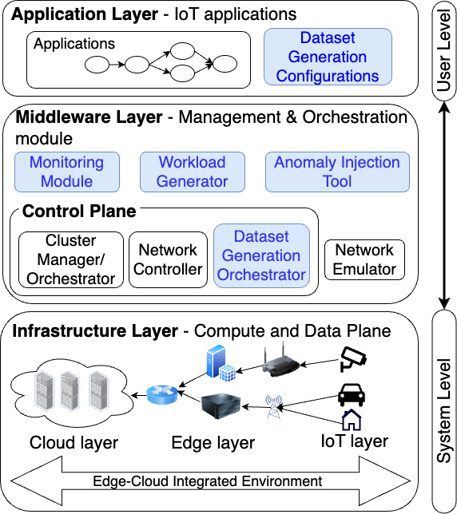
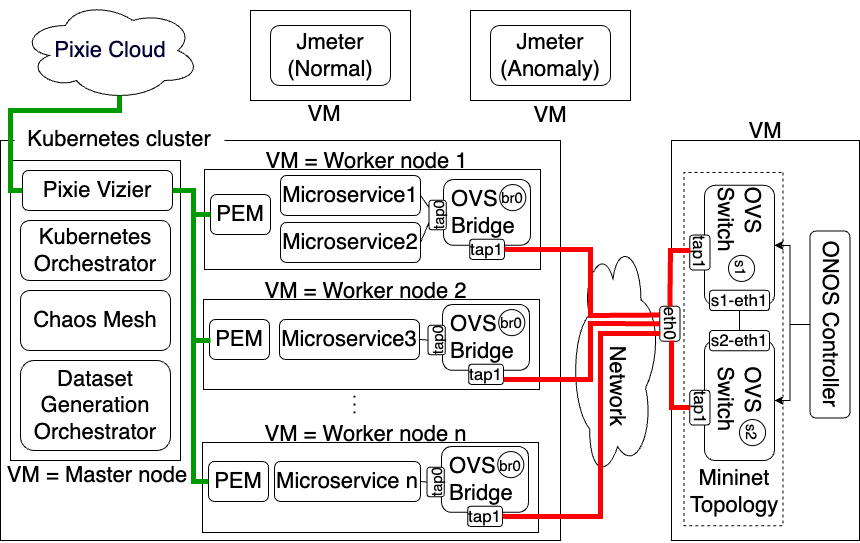

# iAnomaly

## A Toolkit for Generating Performance Anomaly Datasets in Edge-Cloud Integrated Computing Environments

iAnomaly is a full-system emulator equipped with open-source tools and fully automated dataset generation capabilities to generate labeled normal and anomaly data based on user-defined configurations.

## Highlights :
* A full-system emulator 
  * Equipped with the following open-source tools
    * Monitoring tool : Collects performance and system-level metrics. 
    * Workload generation tool : Generates normal performance data. 
    * Chaos engineering mechanism : Injects performance anomalies into applications to simulate anomalous scenarios.
  * Supporting fully automated dataset generation capabilities to generate labeled normal (data collected under normal conditions 
  without anomalies) and anomaly (data collected under anomalous conditions) data based on user-defined configurations. 
  * Having the ability to introduce a wide variety of anomalies including those originating on the client/sensor-side as 
  well as the server-side.
* The source code for a set of microservice-based IoT applications with heterogeneous QoS and resource requirements spanning 
  across a wide range of domains, software architectures, service composition patterns, and communication protocols, making 
  the toolkit versatile for generating data.
* The first open-source edge performance anomaly dataset generated using the iAnomaly toolkit. 

## iAnomaly Architecture & Implementation Details :
Core of the iAnomaly framework is developed using iContinuum (https://github.com/disnetlab/iContinuum) which is a full-system 
emulator. As shown (in blue) in the following system architecture diagram of iAnomaly, we included a monitoring module, a workload generation 
tool, and a tool for injecting anomalies, in the middleware layer of the full-system emulator. As shown in the same diagram, users 
can define the dataset generation configurations through the application layer. The dataset generation orchestrator interprets the 
content from the dataset generation configuration and coordinates with the data generation tools in the toolkit to generate the normal 
and anomaly data required for the performance anomaly dataset. Refer to “Section III. iAnomaly Architecture” of the iAnomaly paper [1] 
for more details.

<div style="text-align: center;">
    
    <p><strong>Figure 1:</strong> System architecture of iAnomaly (newly introduced components in blue)</p>
</div>

During the implementation of iAnomaly, the open-source tools for monitoring, workload generation and chaos engineering were 
realised using Pixie, Jmeter and Chaos Mesh respectively. For more details, refer to the following deployment diagram and 
“Section IV. iAnomaly Implementation” of the iAnomaly paper [1].

<div style="text-align: center;">
    
    <p><strong>Figure 2:</strong> Deployment diagram of the iAnomaly toolkit</p>
</div>

## Instructions for Dataset Generation :

1) Setup the full system emulator component by following the steps of iContinuum.
	https://github.com/disnetlab/iContinuum?tab=readme-ov-file#icontinuum-an-emulation-toolkit-for-intent-based-computing-across-the-edge-to-cloud-continuum 

2) Deploy the IoT applications from which you want to generate the performance anomaly data. You could deploy the IoT applications that we have provided at <link to applications folder> or use your own applications by using iContinuum’s microservices placement mechanism. Refer to “Section V-B. Dataset Generation” of the iAnomaly paper [1] for more details of the dataset generation task we performed.

3) Deploy the newly introduced open-source tools. Follow the above deployment diagram when deploying.
   * Pixie (k8s master node) - https://docs.px.dev/installing-pixie/install-guides/hosted-pixie/new-relic-cloud/ 
   * Jmeter (2 instances in separate VMs outside k8s cluster) - https://dev.to/hitjethva/how-to-install-apache-jmeter-on-ubuntu-20-04-2di9 
   * Chaos Mesh (k8s master node) - https://chaos-mesh.org/docs/quick-start/ 

4) Follow the instructions inside the `automated_dataset_generation` folder to generate a dataset following the sample configuration inside it.

5) Refer to the sample dataset generated using iAnomaly toolkit at the “Sample Dataset” folder.

## References :
[1] Duneesha Fernando, Maria A. Rodriguez, and Rajkumar Buyya. 2024. iAnomaly: A Toolkit for Generating Performance Anomaly Datasets in Edge-Cloud Integrated Computing Environments. arXiv:2411.02868 [cs.DC] https://arxiv.org/abs/2411.02868 

## Cite iAnomaly :
**BibTeX entry**
```
@INPROCEEDINGS{10971830,
  author={Fernando, Duneesha and Rodriguez, Maria A. and Buyya, Rajkumar},
  booktitle={2024 IEEE/ACM 17th International Conference on Utility and Cloud Computing (UCC)}, 
  title={iAnomaly: A Toolkit for Generating Performance Anomaly Datasets in Edge-Cloud Integrated Computing Environments}, 
  year={2024},
  pages={236-245},
  keywords={Cloud computing;Image edge detection;Microservice architectures;Quality of service;Computer architecture;Internet of Things;Anomaly detection;Standards;Edge computing;Service level agreements;Edge computing;Microservices;IoT;Performance anomaly detection;Datasets;Emulators},
  doi={10.1109/UCC63386.2024.00041}}
```
