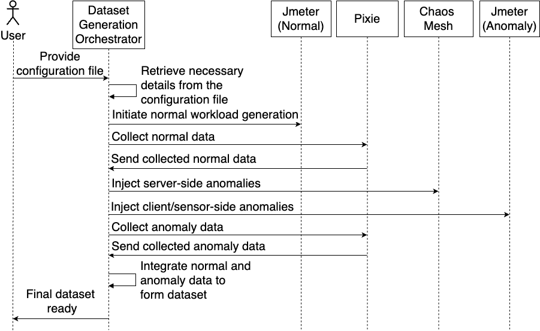

This folder contains the code required to automatically generate a dataset following the 
configurations provided in the `config.yaml` file. 

The dataset generation orchestrator interprets the content from the dataset generation 
configuration/s and coordinates with the data generation tools in the toolkit to produce 
the labeled normal and anomaly data needed for the performance anomaly dataset. For more 
details, refer to the following interaction diagram and “Section IV. iAnomaly Implementation” 
of the iAnomaly paper [1].

    
    
<strong>Figure 1:</strong> Interactions between the dataset generation orchestrator and other components

### Instructions for Automated Dataset Generation :

* We have provided a sample `config.yaml` file in this folder.
  
* As the first step, create 3 helm charts called `cpu-stress`, `memory-stress` and `net-delay`. 
Use the command `helm create NAME` when doing so.
* Then, move the 3 yaml files inside `chaosmesh_yamls` directory in to their respective folders.
* Inside each helm chart directory, locate the file `values.yaml` and add the default values to each file.
  * `cpu-stress`\
    appLabel: "default"\
    load: 80
  * `memory-stress`\
    appLabel: "default"\
    size: "1GB"
  * `net-delay`\
    appLabel: "default"\
    latency: "1100ms"
  
* Prepare the 2 jmeter instances by moving `test_standalone_preprocessor_parameterize.jmx` file inside 
`jmeter_jmx_files` directory to the jmeter-normal instance and the other 2 files (`segment-user-surge-spike.jmx`,
`segment-user-surge-step.jmx`) to the jmeter-anomaly instance. Note how the jmxs have been parameterized.
  
* Activate the Conda environment 
* Execute the dataset generation orchestrator file using the command `python3 config_parser.py` 
to automatically collect data.
